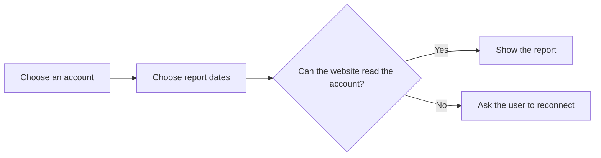
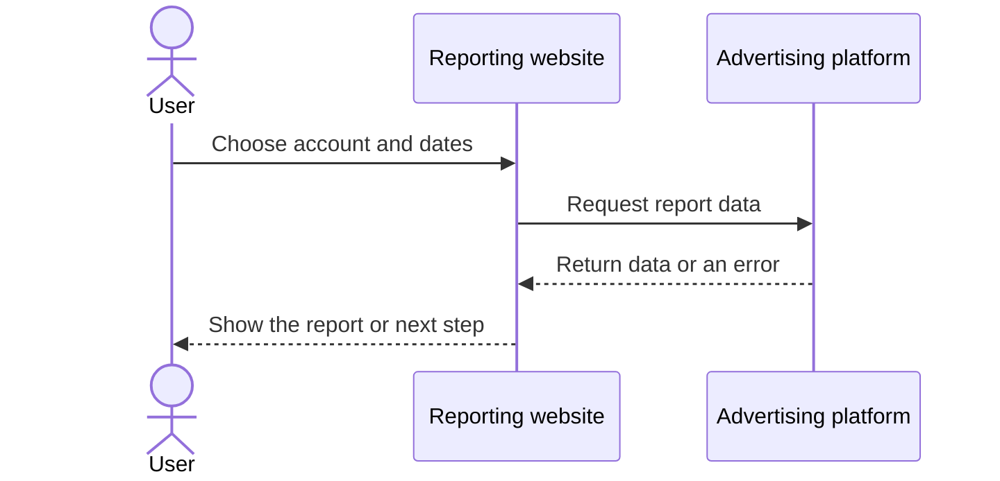

# Plain-English Mermaid Diagram Guidance

Use diagrams only when they make a module easier to understand. The written Features, How it works, Developer test scenarios, Tasks, and Completion criteria sections remain authoritative.

## Applicability

| Condition | Required output |
| --- | --- |
| Fewer than three meaningful user actions with no branch, approval, recovery, handoff, or different outcome | No user diagram |
| At least three meaningful user actions, or any branch, approval, recovery, multi-role handoff, or different outcome | User `flowchart` |
| The flow crosses a website, server, database, external API, queue, automation, webhook, scheduled job, retry, or verification boundary | System `sequenceDiagram` |
| Both user-flow and cross-system conditions apply | Both diagrams |

Count actions performed by a person. A confirmation, immediate screen response, or final result is not another user action.

Treat Mermaid `sequenceDiagram` as the module's UML-style interaction diagram. Show the important request, response, validation, data change, retry, and user-visible outcome supported by the source.

Add `## Flow diagrams` only when at least one diagram applies. Use `### User flow` and `### System flow` only for the diagrams that apply. Do not add placeholder text for an omitted diagram.

## Stage-aware detail

- For `1.1 Idea discovery` and `1.2 Requirement / User story`, show people, product surfaces, and confirmed external systems only.
- For `1.3 Solution planning` and later stages, show technical participants only when the source confirms them.
- Preserve technical details explicitly supplied by the source at any stage.
- If a branch, owner, retry, or system boundary is unclear and would materially change the flow, ask the user before writing. Do not invent the behavior or store a question node in the diagram.

## Plain-English labels

- Use short action phrases such as `Choose report dates`, `Check account access`, or `Show an error`.
- Do not show feature, requirement, task, completion, question, assumption, decision, or rule IDs.
- Avoid jargon. When a platform term is necessary, use the same wording as the written page.
- Ensure every important diagram action is supported by the written Features or How it works section.
- Ensure every result is supported by a feature or completion checkbox.
- Ensure every important alternate, error, approval, and recovery branch is covered by a developer test scenario when product-specification-guidance.md requires one.

## Notion-compatible syntax

- Use a fenced block with the exact language `mermaid`.
- Default user diagrams to `flowchart LR`. Use `flowchart TD` only when branching would make the diagram too wide.
- Use `sequenceDiagram` for system interactions.
- Wrap labels containing punctuation in double quotes.
- Use ` ` for line breaks inside node labels. Never use `\\n` or escaped parentheses.
- Use short participant aliases and readable display names.

Use an external participant only when the source confirms that boundary.

## Size limits

- Show the main path and no more than three important alternate, approval, recovery, or error branches.
- Limit each flowchart to 12 nodes.
- Limit each sequence diagram to six participants and 15 messages.
- Split a larger flow into named scenario diagrams under the same section.
- Keep detail proportional to the module stage.

## Audit and refresh rules

Before creating or replacing a diagram, confirm:

- the applicability rules require it;
- the Mermaid fence and diagram type are valid;
- labels use simple English and valid quoting;
- every action and result is supported by the written page or confirmed source;
- the diagram stays within the size and branch limits;
- it contains no credential, secret, private URL, or unnecessary personal data;
- it does not contradict features, workflow, tasks, completion criteria, or confirmed decisions.
- every important alternate, error, approval, and recovery branch maps to a developer test scenario when test scenarios apply.

Preserve a valid existing diagram during refreshes. When a diagram conflicts with the written page, keep both unchanged, report the exact conflict, and require approval for a proposed replacement.
