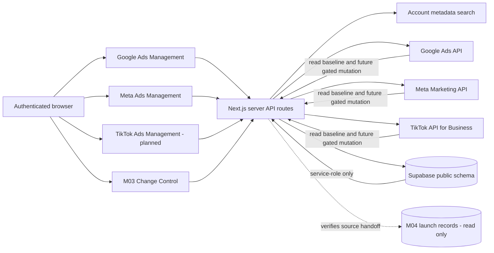
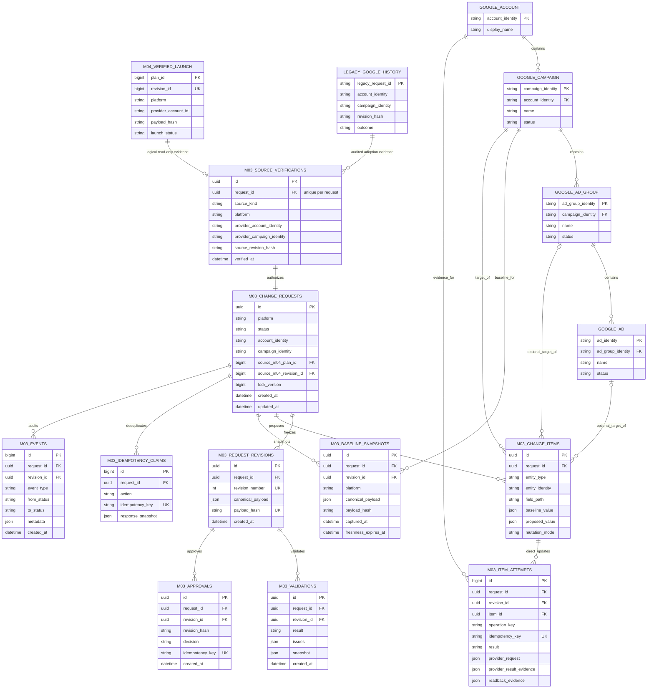
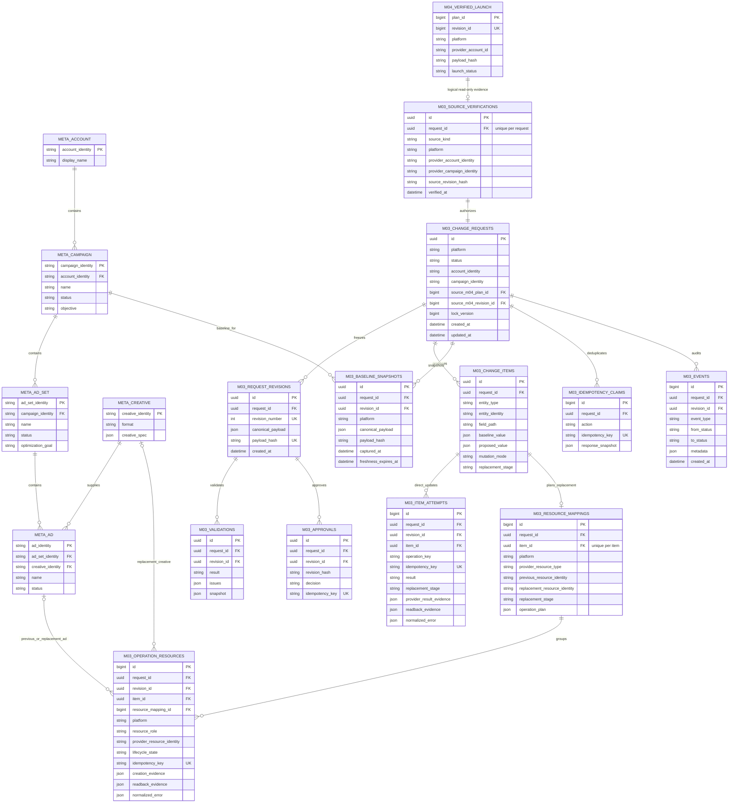
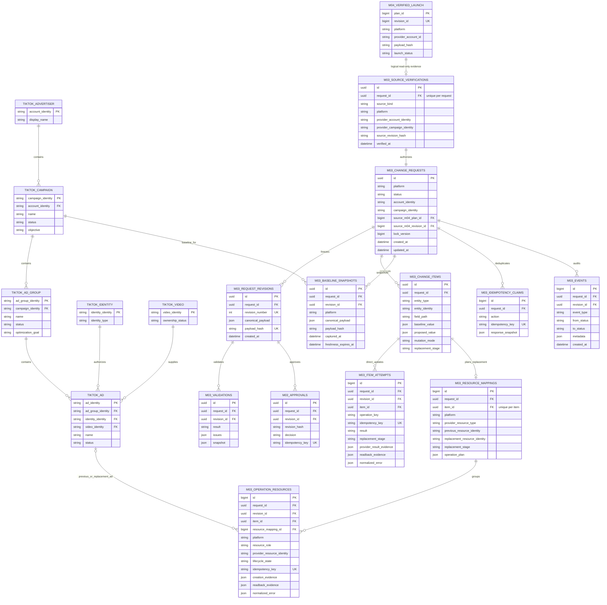
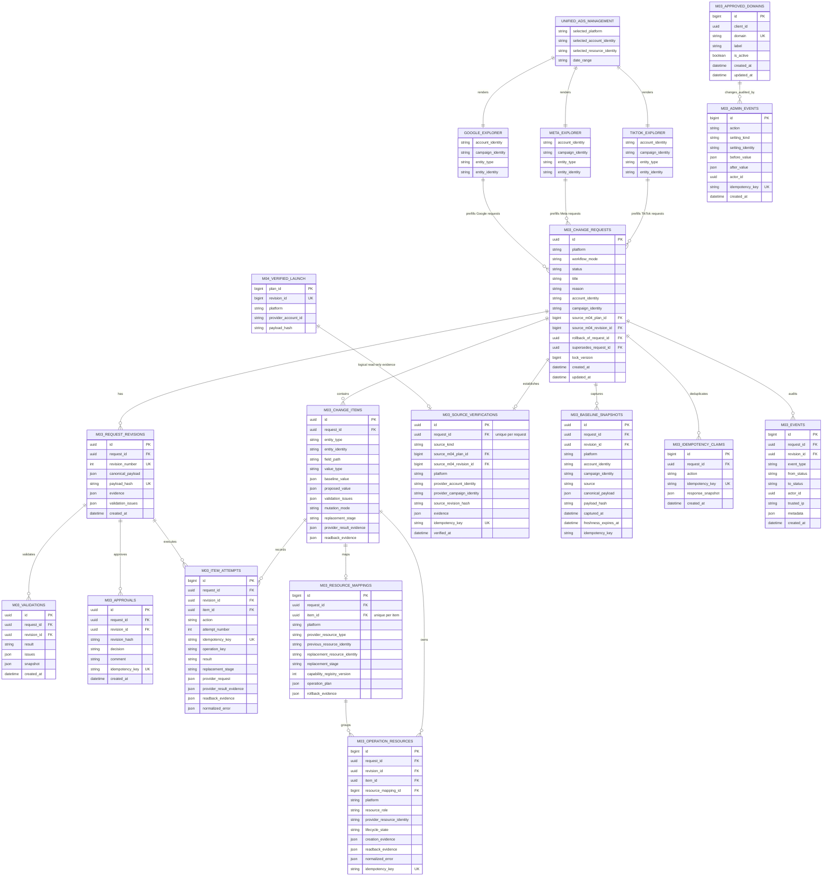

# M03 Change Control and Cross-Platform Ad Management

## 1. System architecture

### Security boundary

1. The browser calls authenticated Next.js routes only.
2. Provider access tokens, client secrets, developer tokens, Supabase secret/service-role keys, and cache gateway secrets remain server-only.
3. Every M03 public table has RLS enabled. Direct `public`, `anon`, and `authenticated` table access is revoked; the server uses `service_role`.
4. Provider mutations additionally require the deployment master gate, audited platform/account settings, exact approved revision, fresh baseline, matching hash, approved operator domain, and explicit publish action.
5. Management-page reads and cached report data do not constitute approval or provider verification.

## 2. Platform ERDs and shared M03 storage

- Only entities prefixed with `M03_` represent M03-owned `public.m03_ads_*` tables.
- `M04_` entities are logical, read-only evidence references; M03 does not update M04 and the diagrams do not imply physical M04 foreign keys.
- Management and provider entities describe integration boundaries, not additional Supabase tables.
- Provider credentials are never stored in the M03 tables.
- Each platform diagram includes the key fields, identities, hashes, evidence, and constraints needed to understand its management and Change Control flow.

### 2.1 Google tables and ERD

- M03 tables used:
  - `m03_ads_change_requests`, `m03_ads_change_request_revisions`, `m03_ads_change_items`.
  - `m03_ads_request_source_verifications`, `m03_ads_provider_baseline_snapshots`.
  - `m03_ads_validation_records`, `m03_ads_change_approvals`.
  - `m03_ads_change_item_attempts`, `m03_ads_provider_resource_mappings`, `m03_ads_idempotency_claims`, `m03_ads_change_events`.
- Google-specific storage behavior:
  - New changes use only the shared M03 tables.
  - Existing `ads_change_*` records remain read-only legacy history.
  - Google does not use the Meta/TikTok `m03_ads_provider_operation_resources` child table.

### 2.2 Meta tables and ERD

- M03 tables used:
  - `m03_ads_change_requests`, `m03_ads_change_request_revisions`, `m03_ads_change_items`.
  - `m03_ads_request_source_verifications`, `m03_ads_provider_baseline_snapshots`.
  - `m03_ads_validation_records`, `m03_ads_change_approvals`.
  - `m03_ads_change_item_attempts`, `m03_ads_provider_resource_mappings`, `m03_ads_provider_operation_resources`.
  - `m03_ads_idempotency_claims`, `m03_ads_change_events`.
- Meta-specific storage behavior:
  - Direct campaign, ad-set, and ad updates store their plans and evidence in the shared tables.
  - Creative replacement uses `m03_ads_provider_resource_mappings` and `m03_ads_provider_operation_resources`.
  - Operation resources may represent the previous ad, replacement creative, and replacement ad.

### 2.3 TikTok tables and ERD

- M03 tables used:
  - `m03_ads_change_requests`, `m03_ads_change_request_revisions`, `m03_ads_change_items`.
  - `m03_ads_request_source_verifications`, `m03_ads_provider_baseline_snapshots`.
  - `m03_ads_validation_records`, `m03_ads_change_approvals`.
  - `m03_ads_change_item_attempts`, `m03_ads_provider_resource_mappings`, `m03_ads_provider_operation_resources`.
  - `m03_ads_idempotency_claims`, `m03_ads_change_events`.
- TikTok-specific storage behavior:
  - Direct campaign, ad-group, and ad updates store their plans and evidence in the shared tables.
  - Non-editable regular-video ad changes use `m03_ads_provider_resource_mappings` and `m03_ads_provider_operation_resources`.
  - TikTok replacement operations use previous-ad and replacement-ad resource roles.

### 2.4 Planned unified Ads Management and Change Control ERD

- This is the planned merged interface, not a new database schema.
- One Ads Management workspace renders Google, Meta, or TikTok account explorers.
- Each explorer embeds the corresponding M03 request builder and review workflow.
- All platforms continue using the same M03 tables and execution gates.

- Management pages remain provider read-only.
- Clicking **Request change** creates or prefills an M03 request.
- Provider adapters remain server-only and cannot mutate a provider unless every M03 execution gate passes.

## 3. M03 Supabase data contract

- Specification sources:
  - [M03 — Cross-Platform Post-Launch Change Control and Verification](https://app.notion.com/p/locus-t/M03-Cross-Platform-Post-Launch-Change-Control-and-Verification-3b14fcc4f701810ea95af78bbc129ca9)
  - [M04 — Cross-Platform Campaign Planning and Launch](https://app.notion.com/p/locus-t/M04-Cross-Platform-Campaign-Planning-and-Launch-3b14fcc4f70181a8be2dcaf0ae84da17)
- Reconciliation date: 2026-08-26.
- Repository source: `supabase/migrations` and the M03 repository access paths in `lib/change-control`.

### 3.1 Responsibility and source of truth

| Area | Responsible system | Source of truth | Boundary |
|---|---|---|---|
| Post-launch drafts and revisions | M03 Change Control | `m03_ads_change_requests`, immutable revisions, and items | Saving or autosaving never calls an advertising provider. |
| Validation and approval | M03 Change Control | Validation records and approval bound to one exact revision hash | Editing after approval creates another revision and requires approval again. |
| Current official provider values | Google, Meta, or TikTok adapter | Fresh canonical baseline snapshot and provider readback | A successful mutation response is not verification; matching readback is required. |
| Provider operation recovery | M03 Change Control | Per-item attempts, resource mappings, and operation resources | Successful operations are not repeated during retry. |
| Initial campaign plan and first launch | M04 Campaign Planning & Launch | M04 plan, immutable revision, and verified monitoring handoff | M03 reads these records only and rejects initial setup work. |
| Provider execution | M03 server workflow | Exact approved revision plus all execution gates | Credentials alone never enable publishing. |
| M05 follow-up | Future M05 module | Deferred | M05 processing is outside this M03 delivery; compatibility references remain dormant. |

### 3.2 M03 table inventory

| Group | M03-owned tables | Why the group exists |
|---|---|---|
| Core workflow | `m03_ads_change_requests`, `m03_ads_change_request_revisions`, `m03_ads_change_items` | Stores the mutable workflow envelope, immutable reviewed versions, and field-level changes. |
| Review control | `m03_ads_validation_records`, `m03_ads_change_approvals` | Stores validation evidence and approval for one exact revision hash. |
| Audit and duplicate protection | `m03_ads_change_events`, `m03_ads_idempotency_claims` | Preserves append-only transitions and prevents repeated logical mutations. |
| Source and conflict preflight | `m03_ads_request_source_verifications`, `m03_ads_provider_baseline_snapshots` | Proves the post-launch boundary and detects stale provider values. |
| Provider execution and recovery | `m03_ads_change_item_attempts`, `m03_ads_provider_resource_mappings`, `m03_ads_provider_operation_resources` | Stores attempts, readback, partial results, and replacement-resource saga progress. |
| Access configuration | `m03_ads_approved_domains`, `m03_ads_admin_events` | Controls approved operator domains and audits configuration changes. `m03_ads_trusted_networks` is retained but reserved for a future phase. |

- Current implementation count: **15 M03-owned public tables**.
- Scope statement:
  - These are all M03 tables currently defined by the repository migrations.
  - They cover the current provider-locked Google, Meta, and TikTok workflow.
  - They do not claim that a future M05 rollout or a future production-publishing phase can never require another additive M03 migration.

### 3.3 Planned use of `public.m03_ads_trusted_networks`

- The table already exists and is left unchanged.
- It is reserved for a possible future live provider-publishing network gate.
- The current M03 workflow does not read, manage, or enforce it.
- Current M03 access uses an active administrator and an approved operator email domain.
- Trusted request IP is still recorded as audit evidence, without matching it against this table.

### 3.4 Read-only M04 dependencies

- These are **not M03-owned tables**.
- They appear here only because the M03 source-verification repository reads them to prove that a request is post-launch.
- M03 must not insert, update, delete, approve, or change the status of these records.

| M04 table | Fields read by M03 | M03 purpose |
|---|---|---|
| `public.m04_ads_campaign_plans` | `id`, `platform`, `status`, `active_revision_id` | Confirms the plan identity, platform, current revision, and launch state. |
| `public.m04_ads_campaign_plan_revisions` | `id`, `plan_id`, `platform`, `provider_account_id`, `payload_hash` | Binds the M03 request to the exact immutable M04 revision and provider account. |
| `public.m04_ads_campaign_monitoring_handoffs` | `id`, `platform`, `provider_account_id`, `provider_campaign_id`, `revision_id`, `revision_hash`, `verified_at`, `final_readback_evidence` | Proves that initial launch verification completed and supplies the provider campaign identity. |

- M04 launch-source rule:
  - The plan, revision, and monitoring handoff must agree on platform, revision, hash, account, and campaign identity.
  - M03 stores the proof in `public.m03_ads_request_source_verifications`.
- Legacy-provider rule:
  - A campaign without an M04 launch handoff requires an audited `legacy_provider_adoption` source verification based on a fresh official baseline.

### 3.5 Historical M04 migration impact

- The current documentation update changes no database object.
- Earlier repository migrations did make additive M04 changes:
  - `20260824033410_isolated_m03_m04_dashboard_readiness.sql` created M04 approved-domain, trusted-network, and campaign-readiness tables while also creating the initial M03 tables.
  - `20260824050641_m03_m04_dashboard_completion.sql` extended M04 access-setting objects and created the M04 configuration audit table.
  - `20260824100000_m04_provider_ready_campaign_forms.sql` updated M04 Meta/TikTok revision-detail constraints and M04 creation behavior for versioned campaign-plan payloads.
- Later provider-operation migrations for M03 Meta and TikTok are M03-only and do not alter M04 tables.
- Operational boundary:
  - Those historical M04 changes belong to M04 readiness/provider-ready work.
  - They are not additional M03 table requirements.
  - New M03 work must keep M04 read-only unless a separately reviewed M04 migration is explicitly authorized.

### 3.6 Legacy Google compatibility tables (read-only)

- Legacy Google history adapter:
  - May read these existing objects.
  - Must not write new changes to them.

| Table | Main structure |
|---|---|
| `ads_change_sets` | Account/platform, title/reason, status, baseline time, version, approved/published/verified timestamps, source/evidence fields. |
| `ads_field_changes` | Entity and field identity, baseline/proposed/latest/published/verified values, validation, conflict decision, publish/verification status. |
| `ads_change_approvals` | Decision, approver, comment, change-set version, time. |
| `ads_change_events` | Field/request event, status transition, actor, message, metadata, trusted request context. |
| `ads_change_notifications` | Historical notification drafts and state. |
| `ads_change_set_revisions` | Immutable canonical legacy payload and hash. |
| `ads_campaign_legacy_adoptions` | Audited adoption of an existing Google campaign. |
| `ads_change_follow_ups` | Historical 7/14-day follow-up records. |
| `ads_change_execution_claims` | Historical short-lived execution claims and hashes. |

- Legacy mutation routes:
  - Return `410 moved_to_m03`.
  - Preserve historical hashes and evidence unchanged.

### 3.7 Management-page storage responsibility

- There are no dedicated Google, Meta, or TikTok management write tables.

- Account discovery comes from the existing account metadata search.
- Reporting and synchronized provider reads are returned by server APIs.
- Recent account choices may be browser-local or cache-backed and are not approval evidence.
- Clicking **Request change** creates a record in the M03 tables above.
- Optional R2/D1 report caching is an optimization layer, not the M03 source of truth.

## 4. Change Control and Ad Management APIs and keys

- This section contains:
  - Internal application API routes.
  - Existing server-side credential names.
  - Planned credential names required for future provider pilots.
- Values are intentionally omitted.
- All secrets must remain in Doppler, Vercel, Cloudflare, or another approved server-side secret manager.
- Never store secret values in source control, browser bundles, URLs, Supabase workflow rows, operation plans, logs, screenshots, or client-side storage.

### 4.1 M03 Change Control

| Method and route | Purpose |
|---|---|
| `GET /api/change-control/requests` | Paginated/filterable request summaries. |
| `POST /api/change-control/requests` | Create an internal draft. |
| `GET /api/change-control/requests/:id` | Full request detail. |
| `PATCH /api/change-control/requests/:id` | Optimistically edit a draft/new revision. |
| `POST .../:id/validate` | Validate and create exact immutable review state. |
| `POST .../:id/approve` | Approve one exact revision/hash. |
| `POST .../:id/cancel` | Cancel an eligible request. |
| `GET .../:id/provider-preview` | Sanitized deterministic provider plan preview. |
| `POST .../:id/publish` | Gated publishing; currently returns `423` while locked. |
| `POST .../:id/retry` | Gated explicit retry. |
| `POST .../:id/verify` | Gated provider readback verification. |
| `POST .../:id/rollback` | Gated creation/execution of a compensating request. |
| `POST .../:id/resolve-conflict` | Gated conflict action. |
| `POST /api/change-control/provider` | Global locked provider action endpoint. |
| `GET/PUT /api/change-control/settings` | Admin settings for M03 operator domains and M04 launch access. M03 trusted-network management is not exposed. |
| `GET /api/change-control/google/resources` | Google resource discovery. |
| `GET /api/change-control/meta/resources` | Meta resource discovery. |
| `GET /api/change-control/tiktok/resources` | TikTok resource/reference discovery. |

### 4.2 Management and discovery reads

| Route | Current consumer |
|---|---|
| `GET /api/notion/accounts/search` | Cross-platform account search/metadata. |
| `GET /api/ads-management/google/campaigns` | Google account/campaign/ad-group/ad metrics and resources. |
| `GET /api/ads-management/google/recommendations` | Google recommendations. |
| `GET /api/ads-management/google/launch-eligibility` | Google launch/adoption evidence read. |
| `GET /api/reporting` | Meta management overview/performance data. |
| `GET /api/reporting/preview` | Meta hierarchy and creative data. |
| `GET /api/reports/:accountId/tiktok-insights` | TikTok reporting/cache read used by the planned explorer. |

- Planned TikTok management routes:
  - `GET /api/ads-management/tiktok/overview`
  - `GET /api/ads-management/tiktok/campaigns`
  - `GET /api/ads-management/tiktok/ad-groups`
  - `GET /api/ads-management/tiktok/ads`
  - `GET /api/ads-management/tiktok/audience-placements`
  - `GET /api/ads-management/tiktok/opportunities`
- Planned unified management route contract:
  - `GET /api/ads-management/accounts/search?platform=google|meta|tiktok`
  - `GET /api/ads-management/:platform/overview`
  - `GET /api/ads-management/:platform/resources`
  - `GET /api/ads-management/:platform/opportunities`
  - `POST /api/change-control/requests` remains the only write entry point.

- Legacy `/api/ads-management/change-requests/*` behavior:
  - `GET` routes remain compatibility reads.
  - Mutation routes return `410 moved_to_m03`.

### 4.3 Missing requirements before provider changes can be enabled

| Area | Specific keys or settings | Still required |
|---|---|---|
| All platforms | Deployment master switch plus audited Supabase settings for enabled platforms and approved account IDs. | Keep the master switch disabled until the pilot is approved. Administrators choose allowed platforms and accounts in Settings. Publishing still requires an approved revision, a fresh conflict-free baseline, and an explicit publish action. |
| Google Ads | Use the existing Google Ads developer token and OAuth credentials. The OAuth token must include the `https://www.googleapis.com/auth/adwords` scope. | Confirm that the authenticated Google user can edit the target customer account, then allowlist that account in M03. |
| Meta Ads | Use `META_ACCESS_TOKEN` with the `ads_management` permission. | Confirm that the token can access the required Business, ad account, Page, Instagram identity, pixel or dataset, and creative assets, then allowlist the account in M03. |
| TikTok Ads | Use `TIKTOK_BUSINESS_ACCESS_TOKEN` with advertiser campaign-management permission. | Confirm that the token is authorized for the target advertiser and can access the required identity, video, pixel, and conversion-event resources, then allowlist the advertiser in M03. |

- Planned configuration improvement:
  - Keep the deployment master switch outside the application as an emergency lock.
  - Move platform and account allowlists into audited Supabase settings managed from the administrator Settings page.
  - Account IDs are configuration values, not secret API keys.
  - Until this improvement is implemented, the current deployment-level platform and account allowlists remain enforced.

### 4.4 Current result

- Google, Meta, and TikTok management pages remain read-only account explorers.
- M03 can store drafts, revisions, approvals, conflicts, and provider-operation plans in Supabase.
- Provider publishing remains locked and no advertising-platform mutation is sent.
- Adding provider credentials alone must not unlock publishing.

## 5. Ad Management page contracts and consolidation plan

### 5.1 Meta Ads Management — implemented

- Route: `/manage/meta`.
- Current responsibilities:
  - Meta-only account search.
  - Recent account choices and cached/read-through data where available.
  - Date range selection and explicit refresh.
  - Overview performance metrics.
  - Campaigns, ad sets, ads, creatives, audience/placements, and opportunities views.
  - Read-only provider exploration.
  - **Request change** handoff to M03 rather than direct provider mutation.
- Storage boundary:
  - The page does not own an approval or mutation table.
  - M03 owns every durable draft, revision, approval, attempt, verification, and audit record.

### 5.2 TikTok Ads Management — planned

- TikTok page direction:
  - Mirror the Google and Meta explorer pattern.
  - Do not duplicate Change Control.

### Page sections

1. TikTok-only searchable account picker.
2. Date range and explicit refresh.
3. Overview metrics.
4. Campaigns.
5. Ad groups.
6. Ads and regular-video creative references.
7. Audience and placements supported by the synchronized/read API.
8. Opportunities/recommendations only when a deterministic source exists.
9. **Request change** actions that deep-link or create an M03 draft.

### Read and change flow

- Read flow:
  - Select a TikTok advertiser.
  - Load normalized data from the server-side read API and optional cache.
  - Use official TikTok GET requests on a cache miss or explicit refresh.
- Change flow:
  - **Request change** creates a prefilled M03 draft.
  - M03 stores the request, items, revision, validation, approval, attempts, and audit evidence.
  - Publishing remains blocked with `423 provider_execution_locked` while the execution gates are disabled.
- See the TikTok storage ERD in section 2.3 and the planned combined workspace ERD in section 2.4.

### 5.3 Merge Change Control into each platform management page — Meta implemented, Google and TikTok planned

- Goal:
  - Place the matching M03 workflow inside each platform explorer:
    - Google Change Control inside `/manage/google`.
    - Meta Change Control inside `/manage/meta`.
    - TikTok Change Control inside the planned `/manage/tiktok`.
  - Let users inspect an entity and request its change without moving to a separate page.
- Page behavior:
  - **Request change** opens an inline M03 request builder prefilled with the selected account, campaign, entity, field, and current value.
  - The page shows drafts, validation, approval, conflicts, operation plans, attempts, verification, and audit history for the selected account.
  - Platform-specific controls remain separate so unsupported fields cannot be submitted accidentally.
- Data boundary:
  - All durable writes continue through the shared M03 APIs and `m03_ads_*` tables.
  - Management-page components do not write directly to Google, Meta, or TikTok.
  - No platform-specific duplicate Change Control tables are created.
- Migration path:
  1. Extract the existing M03 request builder and request-detail views into reusable components. **Complete.**
  2. Add the Google components to `/manage/google`.
  3. Add the Meta components to `/manage/meta`. **Complete.** The account-scoped workspace supports draft creation and editing, validation, policy-aware approval, cancellation, provider-plan preview, conflicts, operation evidence, and audit history.
  4. Add the TikTok components after `/manage/tiktok` is implemented.
  5. Keep `/change-control` as the global request list, administration, and recovery page.

- Meta acceptance status (2026-08-26):
  - Pure capability, query-filtering, request-builder, value-parsing, resource-mapping, conflict-state, response-sanitization, and inactive-resource tests pass.
  - TypeScript and ESLint verification pass; the authenticated `/manage/meta` shell was rendered locally and retains account search and read-only provider messaging.
  - Credentialed Meta connectivity was not marked as passed because the local Doppler token could not access the configured project. The remaining live acceptance check is limited to connectivity and response correctness; it must not issue a provider mutation.
  - Provider publishing, retry, verification, conflict resolution, and rollback execution remain disabled by `provider_execution_locked`. The Meta management and M03 provider-planning paths contain no authorized Meta write operation.

### 5.4 Merge all Ads Management pages into one workspace — planned

- Goal:
  - Merge Google, Meta, and TikTok management into one `/manage/ads` page.
  - Preserve one shared interface while rendering the correct platform-specific explorer and Change Control components.
- Navigation model:
  - Select an account using the shared account picker.
  - Derive the platform from the selected account.
  - Show an explicit Google, Meta, or TikTok switch when multiple provider identities are available.
- Shared layout:
  - Account and date controls.
  - Overview and performance.
  - Campaigns.
  - Ad groups or ad sets.
  - Ads and creatives.
  - Audience and placements.
  - Opportunities or recommendations.
  - Embedded M03 Change Control for the selected platform and account.
- Component boundary:
  - Keep Google, Meta, and TikTok explorer components separate behind one shared shell.
  - Keep provider capability registries, validators, serializers, and adapters separate.
  - Reuse the same M03 APIs and tables.
- Migration path:
  1. Finish the TikTok read-only explorer.
  2. Finish the platform-specific Change Control embedding described in section 5.3.
  3. Extract shared account, date, tabs, metrics, loading, and error components.
  4. Add `/manage/ads` and render the correct platform workspace from the selected account.
  5. Redirect the three platform-specific management routes only after feature parity and acceptance testing.
  6. Keep `/change-control` available until the unified page fully covers global administration and recovery workflows.
- Safety:
  - Management reads remain read-only outside the M03 request workflow.
  - All durable writes continue through M03.
  - Provider execution remains locked unless every M03 gate passes.

## 6. Change-safety rule

- Implementing `/manage/tiktok` or extending a provider adapter must not alter:
  - M04.
  - M05.
  - Reporting.
  - Billing.
  - Authentication.
  - Provider-credential tables.
  - Any unrelated table.
- Any permitted schema addition must be:
  - Additive.
  - Named `m03_ads_*`.
  - RLS-protected.
  - Service-role-only.
  - Verified against a pre-change non-M03 schema snapshot.
